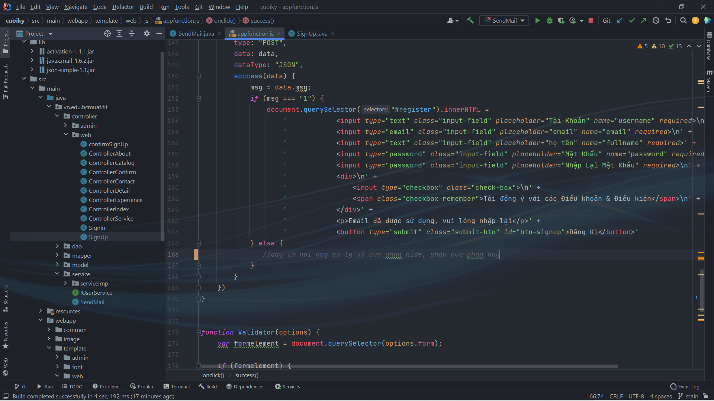
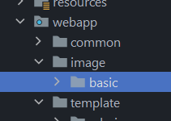
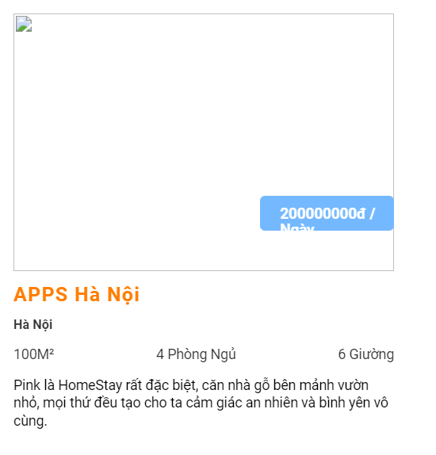

# ProjectWeb-cuoiky-2021-2022

<h1>* Chung</h1>

- Tìm hiểu AJAX
- Tìm hiểu phân trang (video hướng dẫn của thầy Long).

<h2> - Trần Đình Danh</h2>

- Code File SignUp Success
- Sử lý form ẩn hiện lúc nhấn đăng ký, xuất hiện dòng thông báo vidu: "Vui lòng kiểm tra mail để xác nhận đăng ký" code js vào phần comment

- tui chưa thấy imgae house của phần ông.
- image house đặt chung trong một thư folder /image/imagehouse
- 

- tui mới cho load image từ database lên, còn vài chỗ nhìn không được đẹp, ông xem chỉnh lại nha, vidu như chỗ cái price
- 

<h2> - Phạm Công Danh</h2>

- validate form signin,signup, check email is exists
- tui chưa thấy imgae place của phần ông.
- image house đặt chung trong một thư folder /image/imageplace
- 

<h1>###########################</h1>

